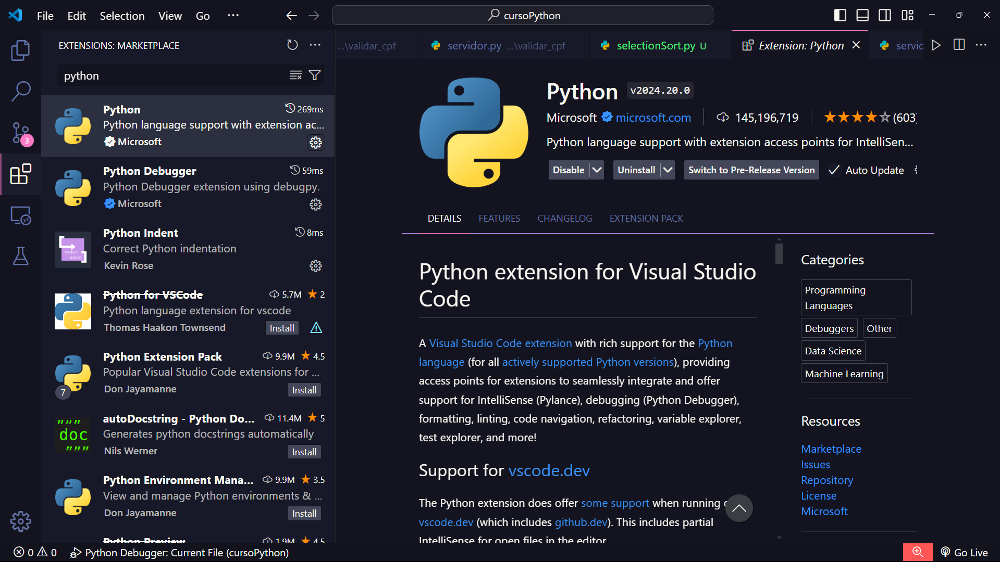

<!-- toc -->
- [Instalação](#instalação)
- [Configuração Inicial](#configuração-inicial)

<!-- toc -->

## Instalação

- Windows
  - Veja o tutorial abaixo
    - [Guia de Instalação](https://python.org.br/instalacao-windows/)
  - ou vá direto pra pagina do site
    - [Link para download](https://www.python.org/downloads/)
- Ubuntu
  - Use o terminal com o seguinte código: 
    - `sudo apt-get install python3.9`
  - Ou veja o tutorial abaixo
    - [Guida de Instalação Linux](https://python.org.br/instalacao-linux/)

## Configuração Inicial para o VSCODE

- Instale a extensão "Python" da microsoft

- `git config --global user.email "seu email"`
- Para reduzir a quantidade de vezes que vocês digitam usuário e senha, você pode orientar o git a armazenar suas credenciais no cache:
  - `git config credential.helper cache`

Se estiver utilizando a máquina do laboratório, lembre de configurar pelo menos o email.
